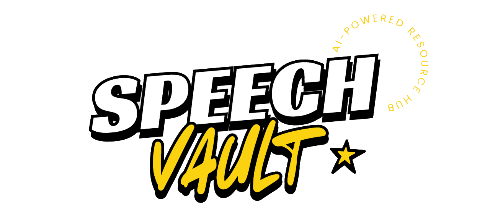

# SpeechVault

## Description
SpeechVault is an AI-powered resource hub designed for speech pathologists working with middle and high school students on social communication skills. The platform centralizes therapy resources (PDFs, videos, activities) and uses RAG (Retrieval Augmented Generation) to enable intelligent conversations with uploaded materials, while generating unlimited conversation starters, role-play scenarios, and text message simulations.

## How It's Made

**Frontend:**

**Backend:**

**AI & ML:**

: Anthropic APIs for language generation

: for document processing and conversation chains

- Supabase Vector for embeddings storage

**Key Integrations:**
- PDF parsing and text extraction
- YouTube video embedding
- Vector similarity search for RAG implementation
- Real-time chat interface

## Future Optimizations

**Advanced AI Features:**
- Multi-modal AI support (image analysis for visual social cues)
- Voice interaction capabilities for speech practice
- Personalized learning paths based on student progress
- Automated assessment tools and progress tracking

**Collaboration & Sharing:**
- Team collaboration features for clinical educators
- Resource sharing marketplace between therapists
- Integration with school district platforms
- Parent/guardian progress dashboards

**Content & Media:**
- Interactive scenario simulations with branching conversations
- Integration with popular therapy apps (Boom Learning, etc.)
- Custom avatar creation for role-play scenarios
- Video call integration for remote therapy sessions

**Analytics & Insights:**
- Advanced analytics on student engagement and progress
- Predictive insights for therapy planning
- Evidence-based outcome tracking
- Research data export for clinical studies

**Technical Enhancements:**
- Offline mode for resource access
- Advanced caching strategies for faster performance
- API rate limiting and usage analytics
- Multi-language support for diverse student populations

## Lessons Learned

---

*This project represents an exciting intersection of AI technology and clinical practice, with the potential to significantly impact how speech pathologists deliver social communication therapy to students.*